### Olá!!! 

  
 Esse repositório contém os prints da execução do desafio final do bootcamp Cloud DevOps Experience - Banco Carrefour. Demonstrando que foi desenvolvido um pipeline de CI/CD com Cloud Build e Terraform.

  

 

1- Criado o bucket "elvisterraform" para receber os arquivos dos estados

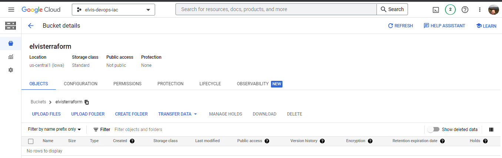 

 
2- incluido no script o bucket "elvisterraform" e auterado o nome na instancia para "cloudbuildterraform"

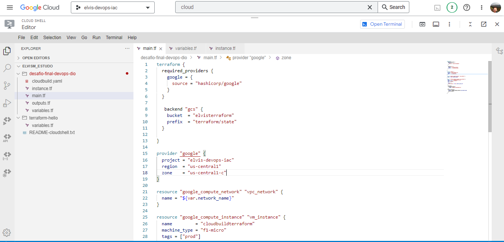 

 
3- Ativado o Cloud Source Repositories

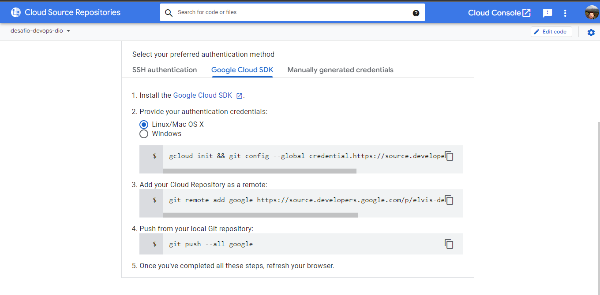 

 
4- Iniciando o git e seguindo seguência de comandos para efetuar o push do repositório para o Cloud Source Repositories

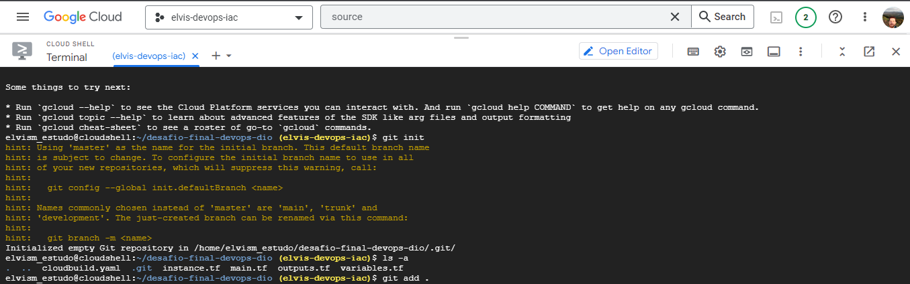 

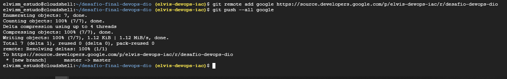 

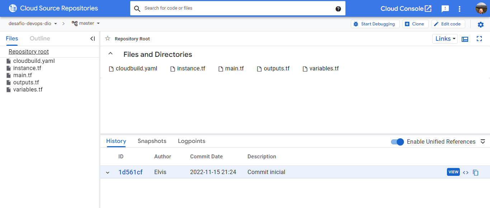 

 
5- Criando uma trigger no Cloud Build

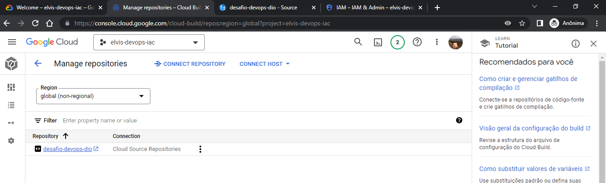 

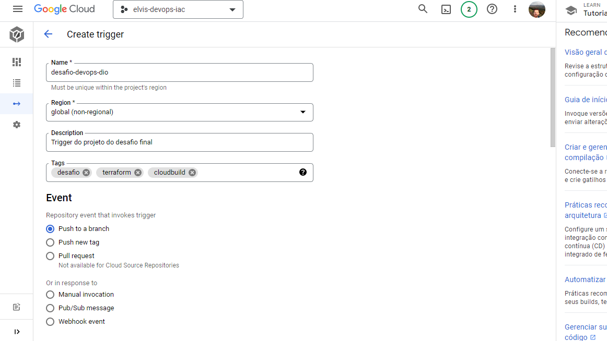 

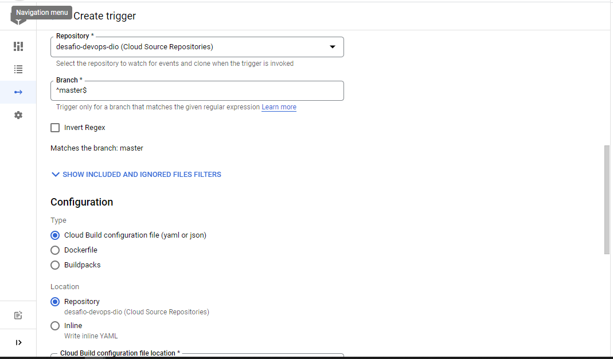 

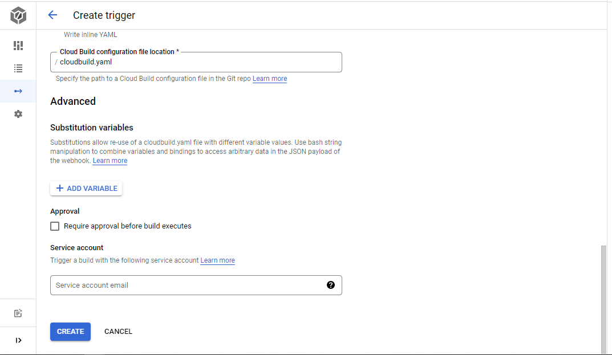 

 
6- Trigger "desafio-devops-dio" criada

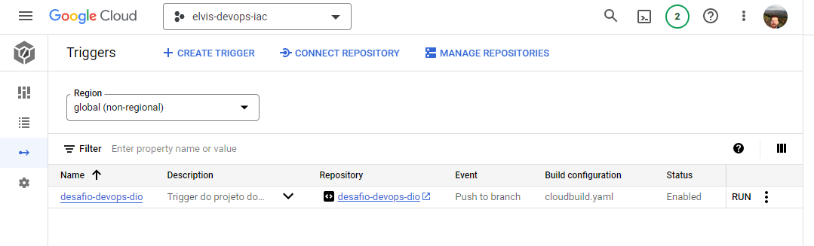 

 
07- Incluindo um arquivo README.md para efetuar um novo push e iniciar a trigger desafio-devops-dio

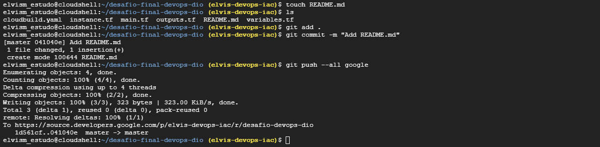 

 
08- Estatus do processo no Build history

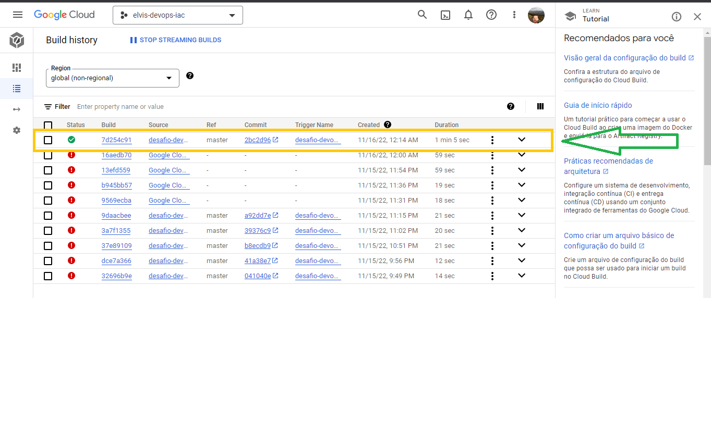 

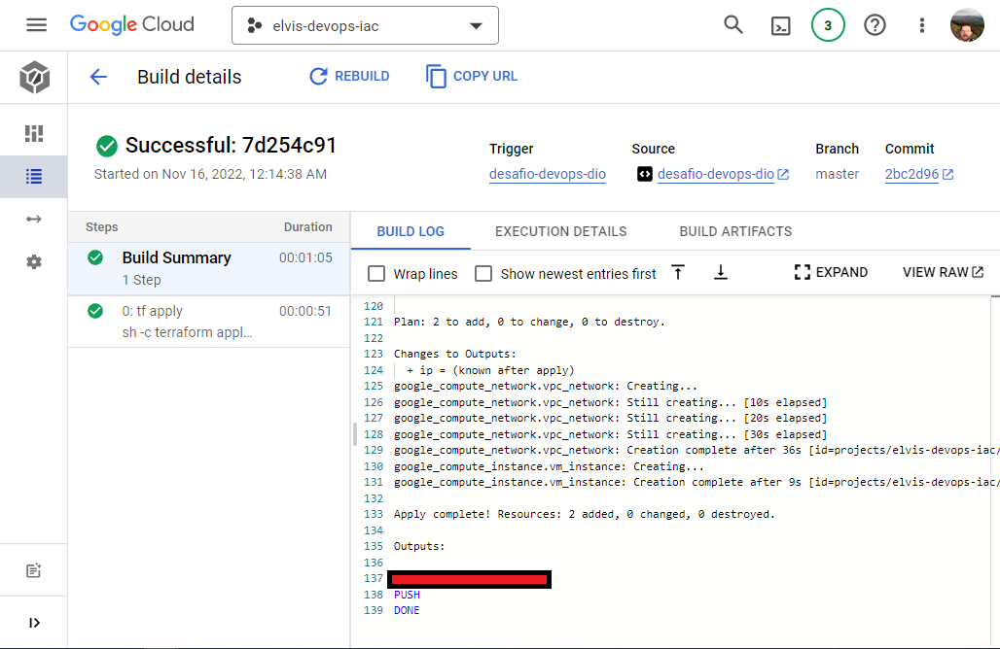 

 
09- Instancia VM cloudbuildterraform criada

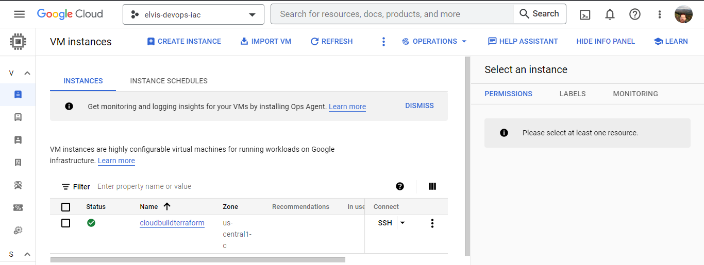 

 
10- VPC Network "terraform-network" criada

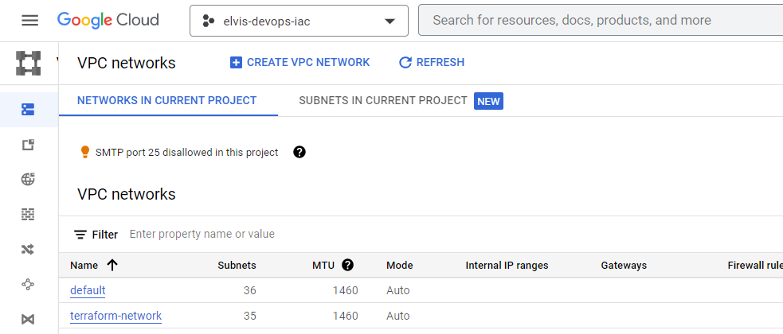 

 
10- State armazenado no bucket elvisterraform

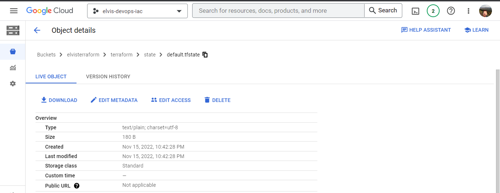 